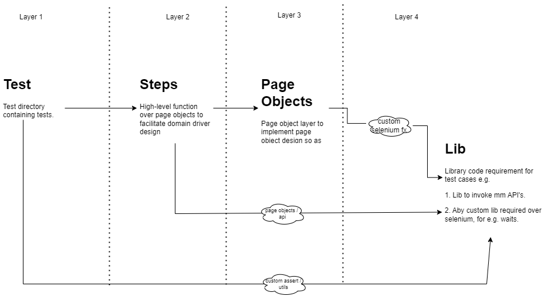

# c8automation-gui

## Steps to run automation
1. Install python (>=3.7)
2. Install pipenv
    ```
    # Windows
    python -m pip install pipenv

    # Linux
    python3 -m pip install pipenv
    ```
3. Install dependecies
    ```
    pipenv install
    ```
4. Download browser driver
    ```
    pipenv run install-driver --browser chrome
    ```
5. Run tests
    ```
    # Example 1: Run all p0 test cases
    pipenv run test --browser chrome --url https://nightly.io --results results/ --html results/result.html -m p0

    # Example 1: Run all login suite test cases
    pipenv run test --browser chrome --url https://nightly.io --html results/result.html -m login
    ```

## Design Considerations
1. Domain specific language
    ```
    https://www.selenium.dev/documentation/test_practices/encouraged/domain_specific_language/
    ```
2. Page Objects
    ```
    https://www.selenium.dev/documentation/test_practices/encouraged/page_object_models/
    ```
3. Fluent Interface
    ```
    https://www.selenium.dev/documentation/test_practices/encouraged/consider_using_a_fluent_api/
    ```

## Architecture

